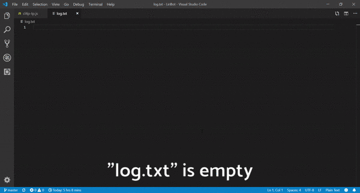
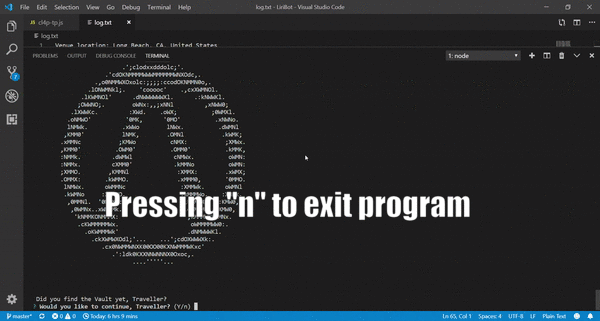

# LiriBot

### [Link to my Github repo](https://github.com/DarrylJLTolentino/LiriBot)

This is my node application that is able to show information based on the users inputs and logs outputs. The current functionality the application has is:

1) concert-this
2) spotify-this-song
3) movie-this
4) do-what-it-says
5) ASCII

Before launching the node application, log.txt is empty. This signifies that nothing has been appended or written into the text file before use.

Accessing the node application requires using a terminal and going inside the directory where the file is located. The user then types "node cl4p-tp.js" to launch the program. Once the program is running, it will prompt the user to choose a command via a list. After running through then entire command and getting information, the application will prompt the user if they want to keep using the function. Pressing "y" will make the application return to the first menu and pressing "n" will close the application.

The concert-this command is used to search the BandsInTown API for a specific artist that will give any upcoming concerts for said artist all over the world. The user can provide an artist name and then the application will provide the venue name, location of venue, and the start time and date of event for every upcoming concert. If the user does not provide an artist name, the application defaults to a search for concert information for the group "Glitch Mob". This information will be displayed within the terminal and within the "log.txt" file.

The spotify-this-song command is used to search the Spotify API for information about a track name. The user can provide a song name and then the application will provide the artist name, track name, album name, and a preview URL, if able. If the user does not provide a track name, the application defaults to "Sign of the Times" by Harry Styles. This information will be displayed within the terminal and within the "log.txt" file.

The movie-this command is used to search the OMDB API for information about a movie title. The user can provide a movie title and then the application will provide the movie title, year released, IMDb rating, country or countries where movie was produced, language(s) the movie is in, the plot, and the actors. If the user does not provide a movie name, the application defaults to the movie "Mr. Nobody". This information will be displayed within the terminal and within the "log.txt" file.

The do-what-it-says command is used to randomly choose a line in a text file called random.txt and read a line. Each line has a command and a search term in the form "command,search term". The application will take the command and then use the predetermined search term and get information based on that search term. If concert-this is chosen, the band One Ok Rock is searched. If spotify-this-song is chosen, the song "I Want It That Way" by the Backstreet Boys is searched. If movie-this is chosen, the movie "Avengers: Endgame" is searched. All the information will be displayed within the terminal and within the "log.txt" file.

The ASCII command is used to display ASCII art of the Borderlands Vault logo, which is the theme of my project. All the quotes used within the commands are from a character in Borderlands named CL4P-TP or Clap Trap. The ASCII art and the text displayed within this command are not logged into the "log.txt" file because this was not an output from an API call. I wanted to differentiate between a legitimate call vs. a predetermined output.

This gif demonstrates how to exit out of the node program after the user is finished using the application.

This gif demonstrates that the "log.txt" file is completely filled with all the outputs from the concert-this, spotify-this-song, movie-this, and do-what-it-says commands after running the program.

This program was created with Node.JS, NPM, Axios, MomentJS, fs, inquirer, Spotify API, BandsInTown API, and the OMDB API.

######

| Technology Used | Reference |
| --------------- | --------- |
| JavaScript | https://www.javascript.com/ |
| NodeJs | https://nodejs.org/en/ |
| Axios | https://www.npmjs.com/package/axios |
| MomentJs | http://momentjs.com/ |
| fs | https://nodejs.org/api/fs.html |
| inquirer | https://www.npmjs.com/package/inquirer |
| Spotify API | https://developer.spotify.com/documentation/web-api/ |
| BandsInTown API | https://manager.bandsintown.com/support/bandsintown-api |
| OMDB API | http://www.omdbapi.com/ |
